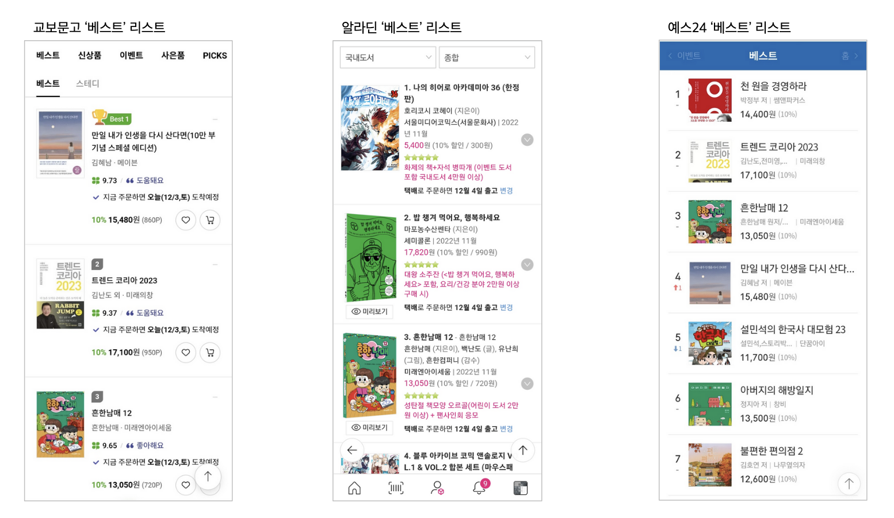
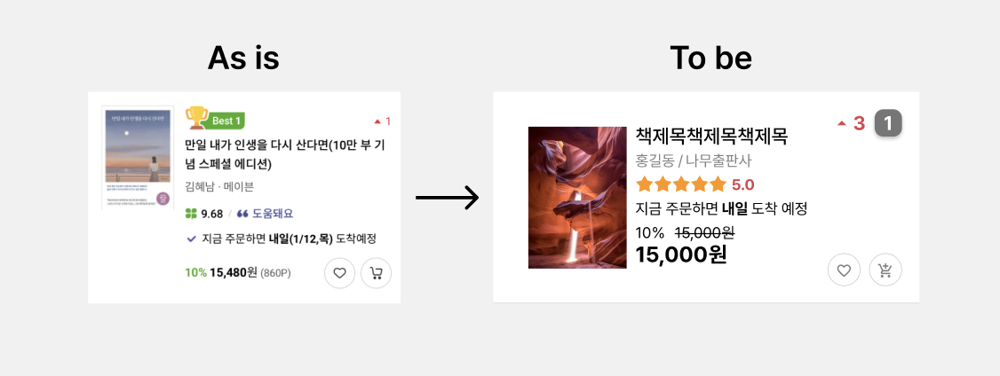
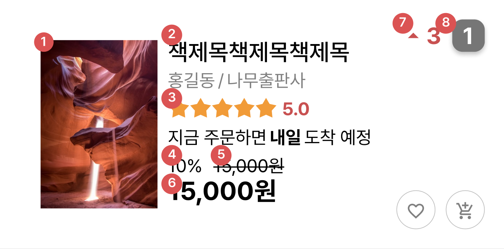
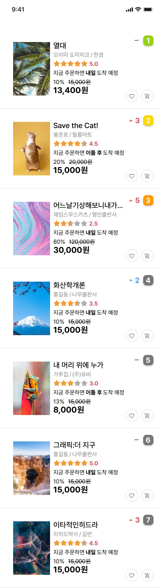



서비스 기획의 플로우와 전반적인 요약

## 서비스 기획
규모별로 기획자의 역할과 책임범위가 다르나, 스타트업의 경우 개발을 제외한 대부분의 역할을 기획자가 맡는 경우가 많다.) 모든 서비스는 사용자의 편의를 위하지만, 궤도에 오른 서비스는 의도적으로 불편함을 넣기도 한다.
## 업무 단계
1. 문제의 발견
    - 직접 서비스를 이용해보면서 불편사항 찾기
    - 구글, 네이버 등 타사에도 비슷한 기능이 있는지 마켓리서치
    - 베치마킹 시에는 특정 페이지 또는 기능으로 범위를 한정하고, 대중적으로 알려진 서비스 2~3 안에서 선택하기
    - 온-오프라인 유저(직원) 목소리 경청, 최대한 핀셋같은 질문으로 구체적인 불편사항을 뽑아내기
    - 주니어 시절 아직 해당 서비스에 익숙하지 않을 때의 신선한 시선을 기억하자
    - 내부 직원 의견 모니터링 시 회의 느낌으로 일정을 따로 잡아 업무로 접근하기
2. 요구사항 분석
    - 요구사항을 아카이빙하기(매우 중요하며 툴 아사나를 사용하기도)
    - 요구사항의 ‘WHY’를 파악하기
    - 분석단계에서 구체적인 해결 방안까지 기입할 필요는 없음
    - 당장 해결이 불가능하더라도 분석서 형식으로 정리 후 사내 공유가 가능한 플랫폼에 모아두기
    - 아카이빙된 요구사항 중 동일한 불만사항이 수차례 접수되면 작업 우선순위를 높여서 진행
3. 상위기획
    - 많은 요구사항 중 실제 진행할 프로젝트를 팀내 협의 후 결정
    - 구체적인 정책과 방안을 정하는 과정이며, 개발자와 협의를 위한 최초 문서로 작업 방향성을 공유
    - 기능명세서, 메뉴구조도, 케이스별 정책 등의 자료가 추가되기도..!
4. 상세기획
    - 표지 / 기획안 히스토리 / 개요 / 플로우차트 / 화면 세부 설명 등으로 진행.
    - 현업에서는 피그마, ppt 등의 다양한 툴을 사용하며 기획안에서 분량을 가장 많이 차지함.
    - 협업하는 개발자/디자이너가 시니어/주니어인지에 따라 기획안의 디테일과 자세함이 달라짐.
    - 기획안에 디자인을 하지말자! 디자이너/개발자의 고유의 영역을 침범하지 말자.
5. 개발 중 커뮤니케이션
    - 인하우스 조직에서 일할 경우, 협업 시 항상 조심
    - 범위가 모호하고 책임범위가 불분명한 경우 담당자(디자이너/개발자)와 무조건 협의하기.
6. QA 테스트
    - 규모가 작은 스타트업에서는 기획자가 QA까지 진행하는 경우가 대부분.
    - 본인이 작성한 기획안대로 구현되는지 테스트 진행 (웹, 모바일, 다양한 브라우저, 기종)
    - 특히 카카오톡 인앱 브라우저나 네이버 인앱 브라우저 주의!
    - 버그리포트 작성 시 화면 녹화 영상이나 오류사진을 첨부하면 더더욱 좋음!
7. 서비스 오픈
    - 오픈 후 서비스 모니터링, 특히 테스트 당시 오류있었던 항목들 위주로 재점검.
    - 오픈 후 7일 이내 프로젝트 회고 회의 진행. 범인찾기가 아닌 개선점을 찾는 시간으로!
> 개발자가 좋아하는 상세 기획안  

    - 명확할 것. 모호한 표현 없애기.
    - 경우의 수 최대한 많이 고려
    - 정해진 것, 변경 가능성 있는 것 기획안에 명시하기. (주로 데이터 구조에 연관된 것)
    - 케이스별로 결과가 달리지는 기능이라면 플로우 차트로 도식화하기.

> 예외케이스들  

    - 이용자들은 기획자가 설계한 프로세스 순으로 서비스를 이용하지 않음.
    - 우선 정상 시나리오 순으로 상세 기획안 작성 후 예외 케이스들 체크하기.
    - 초기값, 노출방식, 글자 수 제한, 로딩 중, 삭제된 컨텐츠, 이용자별 권한, 키보드 액션 등.

> Back-office  

    - 각 회사, 서비스마다 필요한 항목이 다름
    - 회원관리, 상품관리, 매출관리, 통계 등

## 실습
교보문고 모바일 '베스트' 리스트 개선
### 목적 및 배경
- 사용자가 원하는 정보를 직관적으로 제공하고 있지 않아 ui 개선작업을 진행하고자함.
### 작업범위
- 모바일 '베스트' 리스트 ui 개선
### 정책 및 고려 사항
- 북커버 크기 수정(확대)
- 책 순위 위치 변경 (오른쪽 상단으로)
- 순위 변동 내역 위치 변경 : 순위 변동은 책 순위와 관계있는 정보이므로 책 순위 표시 하단에 배치
- 평가내용 제거(도움돼요/좋아해요) : 유저에게 평점과 같은 맥락의 정보를 제공하지만, 평점에 비해 객관적인 정보가 아니므로 혼란방지를 위해 제거
- 별점 이미지 수정 : 별점이 별점인지 직관적으로 파악하기 어려워 네잎클로버 아이콘을 별 아이콘으로 변경
- 적립 포인트 제거
### 타사 비교

- 알라딘
    - 순위와 책제목이 함께 표기
    - 직관성있는 별점 항목
    - 이벤트 서적 표기
- yes24
    - 제목이 긴 경우 ...으로 축약
    - 북커버를 1:1 비율로 크롭
    - 책 순위/순위변동 정보가 연관성있게 묶여있음
    - 최소 정보만 나열
### As is / To be

### 상세기획

1. 북커버 - 스케일 확대 후 책 제목과 상단 정렬
2. 책제목 - 일정 글자 수를 초과하면 축약형으로 표기 (...)
3. 평점 - "도움돼요" 등 로고 제거 후 네잎클로버 아이콘을 직관성있는 아이콘으로 변경(ex 별)
4. 할인% - 원가격 좌측에 % 표시
5. 원가격 - 할인% 우측에 원가격 표시
6. 할인가격 - 할인%, 원가격 하단에 표시(할인%, 원가격 보다 큰 폰트)
7. 순위변동 - 책 순위 좌측에 표기
8. 책 순위 - 우측 상단으로 위치 변경. 1,2,3 등만 강조 색상 첨가

### 프로토타입

