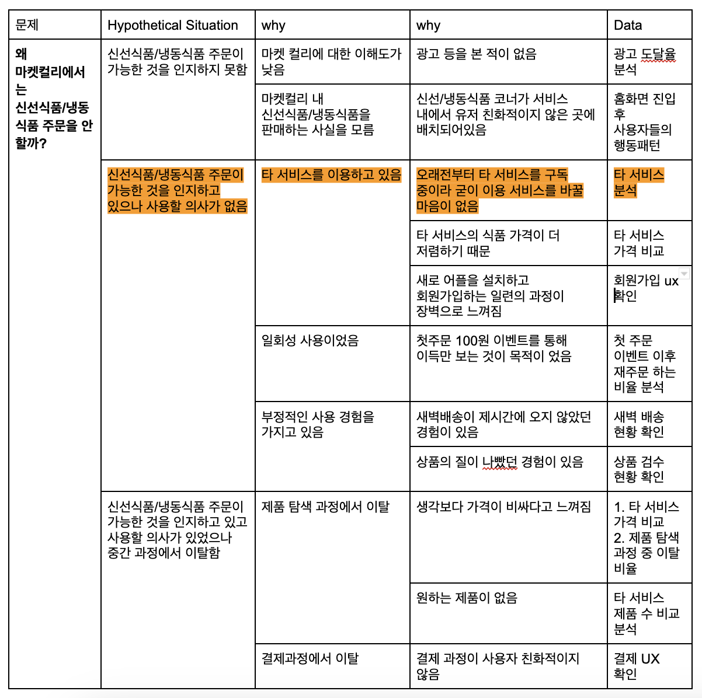

# UX리서치
## UX리서치에 대한 오해와 진실
- 리서치를 통해 매번 놀랍고 새로운 발견? 그것보다는 개선에 도움을 줄 수 있다!
- 사용자에 대한 일반적인 정보를 수집? 그것보다는 구체적인 연구 목표를 정의해야함!
- 어설픈 사용자 조사를 하는 것 보다 어떤 사용자 조사도 하지 않는 것이 더 낫다.
- 사용자의 답변을… 믿으면 안됨. A를 고르고 B처럼 행동하는 유저가 한가득.
## 리서치 방법
### 정성 조사
- 보통 집단을 대표할 수 있는 소규모 그룹과 기초적 원인, 동기에 대한 질적인 이해 목적으로 진행
- 표본 수 자체가 적어 신뢰도에 문제가...
1. 그룹 인터뷰
    - 장점 : 유저들의 공통적인 페인포인트 혹은 니즈를 빠르게 발견 가능
    - 단점 : 모더레이터의 능력에 따라 그룹 인터뷰의 결과가 좌우됨… 빅마우스를 잘 컨트롤해야
2. 심층 인터뷰
    - 장점 : 해결하고자 하는 what에 대한 why를 정확하게 알 수 있음!
    - 단점 : 사용자들의 말과 행동은 별개의 것… 시간소요도 큰 편
3. 사용성 테스트
    - 장점 : UI/UX 관련 명확한 문제점 발견 가능
    - 단점 : 진행자가 있다면 유저가 평소처럼 자연스럽게 서비스 이용이 불가능(관찰자 효과)
4. 에스노그라피 & 맥락적 조사
    - 에스노그라피 : 유저 리서치에서는 유저들이 일상생활에서 어떻게 해당 앱을 사용하는지 관찰하는데 사용됨!
    - 맥락적 조사 : 심층 인터뷰와 에스노그라피의 혼합체. 유저가 자신의 자신의 환경 속에서 일하는 동안 관찰되고 질문 받음
### 정량 조사
- 빠르게 다양한 유저들의 의견 듣는 과정으로, 정성조사 후 표본으로부터 얻는 결과를 일반화시키는 것이 목적...
- 단독으로 사용될 때도 있지만, 주로 2차 설문 조사 또는 후속 정성 조사를 통해 더욱 심도 있는 인사이트를 도출
    - 장점 : 좀 더 많은 데이터를 확보함으로써 인사이트의 신빙성을 올려주며, 복수의 고객 그룹에서 유의미한 데이터를 얻을 수 있음!
    - 단점 : 설계가 제대로 안 됐을 때는 부정확한 인사이트가 나올 수 있고, 자기보고 편향이 존재함
### 실무에서 사용하는 삼각법 / 혼합연구법
- 스포티파이 등의 기업에서도 주로 사용되는 리서치 방법
- 2가지(정량/정석 분석) 이상의 리서치 방법을 최대한 모든 프로젝트에서 활용
- **정성/정량 방법으로 데이터를 수집하여 각 데이터의 장점을 강화하고 단점을 보완한다는 점에서 효과적임!**
##  실무 프로세스
1. 발견 - 유저의 니즈와 페인포인트 찾기
2. 정의 - 기능과 디자인 정의
3. 전달 - 디자인 확정/사용성 확인/사용성 테스트
4. 평가 - 사용자의 반응/데이터 확인 후 추가 리서치
### 리서치 진행 방법
1. 딥다이브
    - 표면적으로 드러난 문제/현상에서 딥다이브해서 근본적인 이유를 파고들어야 함
    - 퍼널 분석을 통해 이탈율을 분석해야함
2. 가설 도출
    - 진짜로 다뤄야하는 문제를 정의
        - 원인/해결방안이 섞여있는 문제 X
            - 이벤트 배너가 안 보여서 이벤트 신청이 충분히 안 일어나는 것 같아요 X
            - 간편결제가 없어서 사람들이 결제를 안 해요 X
        - 문제/원인/해결방안을 구분하고 풀고자 하는 문제를 명확하게!
            - 이벤트 신청이 작년 대비/지난 달 대비 저조하다
            - 결제 이탈률이 업계 평균보다 높다
    - 모든 경우의 수를 열어두고 문제의 원인을 고려
        - "어째서"와 "왜"를 반복
        - 적당히 멈추고 가설을 세우는 건 지양
    - 확인해야하는 정확한 지표/데이터 설정
        - 원인에 대한 검증 및 논리적인 결론을 낼 수 있는 걸로 지표/데이터 설정
### 성공적인 조사를 위해서
1. 정성조사에서 개방형 질문하기
    - A가 마음에 드시나요? -> A에 대해서 어떻게 생각하시나요?
    - 기능 A를 사용하시나요? -> 어떤 기능들을 주로 사용하시나요?
    - A 과정에 만족하셨나요? -> A 과정은 어떠셨나요?
    - A 제품을 B사에서 구매하시나요? -> A 제품을 주로 어디서 구매하시나요?
2. 중립적인 톤 유지하기
    - 야심차게 준비한 신기능..! 어떠신가요? -> 긍정적인 답변 유도 금지
    - 이 페이지 이해하셨죠? -> 특정 답변 유도 금지
    - 이건 어려워 보이시네요. 그렇죠? -> 유저의 감정/생각 재단 금지
3. 꼬리물기 질문하기
    - B사에서는 A 제품 구매 안해요! -> 왜 B사에서는 A 제품을 구매 안 하시나요?
    - 저는 주로 B'사에서 구매해요! -> 주로 B'사에서 구매하는 이유는 무엇인가요?
    - B'사에는 제품 갯수도 많고 신뢰가 가서요! -> B'사에는 제품 갯수도 많고 신뢰도 간다고 하셨는데, 조금만 더 설명해주실 수 있을까요?
###  IDI(인뎁스 인터뷰)
1. 라포형성
    - 더 나은 인터뷰 결과를 위해 참가자와 친밀감/신뢰를 쌓는 과정
2. 질문하기
    - 얻어내야하는 정보에서 멀어지지 않기 위해 기둥질문&가지질문 형식을 취한다
    - 유도질문, Yes or No, 답정너 질문, 퉁쳐서 하는 질문은 금지
    - 유저의 이탈지점과 문제점을 알아보는 것이 중요
3. 해야하는 질문
    - 서비스 외적인 질문
        - 전반적인 옷 구매 방법(옷을 어디서 고르고, 왜 그 쇼핑몰을 골랐는지 등)
    - 서비스 내적인 질문
        -  그렇다면 우리 서비스를 이용할 때는 어떻게 행동했는지
4. 피해야하는 질문
    - 소비자가 과도하게 생각하고 분석해야하는 질문
        - 6개월 내 가장 많이 쓴 앱이 뭔가요? 그건 왜 썼나요?
> **정성조사 후 정량조사 진행**
> 정성조사로 소수의 케이스를 파악 후
> 정량조사로 전체 인원, 많은 인원에서 해당 케이스의 경향이 어떤지 파악해야함.
## 실습
### 1. 카카오 블루 택시
1. 딥다이브
    
2. 진짜로 다뤄야하는 문제를 정의
  
3. 모든 경우의 수를 열어두고 문제의 원인을 고려
    
4. 확인해야하는 정확한 지표/데이터 설정

### 2. 마켓 컬리
1. 딥다이브 
2. 가설도출
- 진짜로 다뤄야하는 문제를 정의
    - 왜 고객들은 마켓컬리에서 신선/냉동제품 구매를 하지 않을까?
- 모든 경우의 수를 열어두고 문제의 원인을 고려
    - 딥다이브와 각종 지표/데이터
- 확인해야하는 정확한 지표/데이터 설정
    - 오픈서베이 리포트 등 참고
> **리서치의 증명**
> " 000를 봤을 때 000이기 때문에 000 할 것이다 "
> **리서치** : 제품 탐색/비교 과정에서 타사 대비 높은 제품 가격을 봤을 때,
> **원인** : 고객들은 금전적으로 부담을 느껴
> **결과** : 마켓 컬리를 사용하지 않을 것이다.

3. 리서치 증명
1.  고객이 마켓 컬리에서 제품을 탐색하는 과정
2.  그 과정 속에서 느끼는 페인포인트와 니즈
3.  현재로서의 솔루션은?

조사설계
카카오 블루 서비스 존재를 알지만 사용의사가 없음
저번에 한번 써본적있음
지난 카카오 블루 택시 탑승시 경험이 좋지 않아 서비스에 대한 신뢰도가 낮음
(카카오 블루 택시 탑승 후기 및 평점)

카카오 블루 택시에 평점을 낮게(1~2)
최근 7일 이내 카카오 블루를 사용한 사람

블루 서비스를 사용했던 이유(어떤 기대치를 가지고 신청했는지, 그리고 해결이 됐는지)
블루 서비스를 사용했을 때 처음부터 끝까지 과정
블루 서비스를 부정적으로 평가 한 이유

블루 서비스를 다시 사용하지 않는 이유

1. 사진 다시 찍기
2. 보유 기술 20개 이상
3. 직무관련 내용 2둘이상
4. 추천서 3개이상
5. 콘텐츠 주 1회이상 생산
6. 다양한 분야 현직자 1촌(500명 이상)
7. 간단한 메세지로 현직자에게 커피챗 요청
8. 영상.노션 등이 가능한 스페셜 카데고리 구성
9. 관심 기업이나 리더 해쉬태크 등을 할로우

구글폼으로라도 정량조사를 돌린다.
1. 수영을 다녀본적 있나요?
2. 수영경력이 얼마나 되나요?
5. 수영장을 선택할 때 가장 중요하게 생각하는 것(가격, 강습시간, 강사의 태도 등)
6. 선택 과정에서 사용하는 서비스(카카오맵? 네이버맵?

정성조사
대상 : 수영장을 한번 이상 다녀본 사람

현재 수영생활 상황
1. 현재 수영장을 다니고 있나요?
2. 그만두었다면 그 이유는 무엇인가요?
3. 계속 다니고 있다면 그 이유는 무엇인가요? (만족?)

수영장 등록과정
1. 수영장을 서칭하는 과정이 어떻게 되나요?(어떤 서비스 사용, 그리고 그 순서)
2. 수영장을 선택하는 기준은 무엇인가요?(강사, 비용, 시설 등)

온라인 커뮤니티활용
1. 인지하고 있는지? 방문해봤는지?
2. 네이버 카페나 다양한 사이트들 방문 했는지? 등

4050대 주부 중

현재 상황
-  기존에는 다른 주부들과 어떻게 관계를 형성했나요?
-  기존에는 다른 주부들과 어떻게 정보를 교환하고있나요?

커뮤니티 서비스 활용

- 현재 커뮤니티를 사용하고 계신가요?
- 커뮤니티에서 관계를 형성하는 과정이 어떻게 되시나요?
- 커뮤니티에서 정보를 찾는 과정이 어떻게 되시나요?

- 그렇다면 어떤 방법으로 주부 관련 정보를 얻으시나요?(검색?)
- 그 과정이 어떻게 되시나요?

주부들을 위한 커뮤니티 앱을 만들고 싶다.
주부들의 정보교환 장을 만들고싶다.

주부들이 정보를 교환하는 과정에서의 페인포인트 및 니즈

관계형성 : 

정보탐색 : 주변인 / 온라인 커뮤니티 / 오프라인

정보수집(평가, 비교) : 전문가가 아닌 입소문(부정확성), 정보를 얻는 것까지 걸리는 시간

정보활용 : 정보를 활용한 부정적인 경험으로 이어질 수 있음

그 다음 제너럴과 익스트림 유저 그룹을 나눠야함
익스트림인 경우/일반 제너럴 인경우
- 다수에게 정보를 공급하는 위치를 가진 사람/공급된 정보를 읽는 사람
- 커뮤니티의 운영자 혹은 주최자 / 참여자
- 커뮤니티활동을 열심히 하는지/보기만하는지
-> 스크리닝 서베이를 통해 이걸 걸러낸다.

신분체크 (익스트림/제너럴을 가르는)

최근 1개월 안에 타 주부들과 정보교환을 1회 이상 한 주부를 대상으로

**정보를 교환한 플랫폼**
가장 최근에 정보교환을 한 플랫폼(온라인/오프라인)
정보교환을 한 플랫폼을 알게된 과정
플랫폼을 선택한 이유

**정보탐색/습득 과정**
정보를 얻기 위해 어떤 과정을 거쳤는지
정보 획득까지 걸린 시간은 얼마나 걸렸는지

**정보를 활용한 과정**
정보의 만족도가 높았는지
해당 정보에 만족했는지

해당 정보에 관심을 가진 이유
정보를 공유하게된 과정
커뮤니티에서 정보를 얻기위해 어떤 과정을 거쳤는지

최근에 사용한 커뮤니티: 커뮤니티를 알게된 과정/ 커뮤니티에 매력을 느낀 이유 / 커뮤니티에서 정보를 얻기위해 어떤 과정을 거쳤는지.

**최근 1개월 내 메이크업 제품을 구매한적있나요?**

**메이크업 제품** : 최근에 구매한 메이크업 제품, 구매 횟수, 구매 주기, 사용 브랜드 갯수

**메이크업 서비스** : 서비스 사용 유무, 서비스 사용 갯수(이상이하), 가장 최근에 사용한 서비스 이름, 가장 많이 사용하는 서비스 이용 이유

**신분체크** : 컨텐츠 생산(sns나 youtube를 활용한) 유무, 직무 체크, 

  

최근에 구매한 메이크업 상품 : 제품을 알게된 과정/ 제품을 매력적이게 느낀 이유/제품에 대한 정보를 얻기 위해 어떤 과정을 거쳤는지

제품 판단 기준

  

주부들을 위한 커뮤니티앱을 만들고싶다.

주

#########
여성들을 위한 메이크업 관련 서비스를 만들고 싶다. 우린 무엇을 파악해야할까?
1. 기존에 메이크업 제품의 탐색 - 구매 과정 먼저 파악
2. 그 과정 속에서 느끼는 페인포인트와 니즈
3. 현재로서의 솔루션은?

가설 세우기 전에 뭘 할 수 있을까?
1. 직접 그 여정을 수행하는 것. 아! 내가 메이크업 제품을 찾아봐야겠다. 뭐뭐를 찾는 부분에서 문제가 생길 수 있겠구나(정보가 없는 상태에서의 근거)

그렇다면 설문조사의 최적의 대상자는?
1. General (일반 그룹) 
2. Extreme User Group(특이그룹)
이 둘을 나누는 기준은 해당 컨텐츠를 만드는 사람인지 아닌지/메이크업 제품통계(사용횟수 등) 중간값, 사용하는 메이크업 서비스(앱)
결국 원하는 대상자를 뽑기위해 스크리닝 서베이를 진행함.(공개필터 느낌, 즉 정량조사)
정성조사 전에 정말 많은 사람 대상으로 정량조사를 싹 한번 돌린다.

인지 - 시장조사 리포트 확인, 
탐색/비교
평가/결정
구매
ㅁ
ㅁㅁㅁㅁㅁㅁㅁㅁㅁㅁㅁ