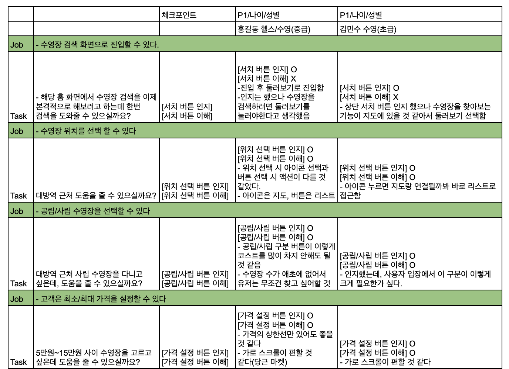
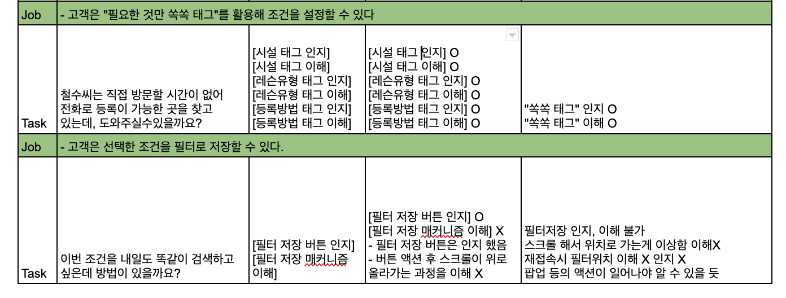



## UI로 확인할 수 없는 것
- 이 기능을 추후에 사용할지
- 얼마나 많은 사람들이 이 기능을 좋아할지
- 해당 디자인이 밴드 목표 달성에 얼마나 영향을 미칠지
- 새로운 기능을 기존 기능보다 얼마나 더 사용gkfwl
## 목표 정하기
- 해당 디자인을 테스트하려는 이유를 생각해보는게 중요
- 사용자의 테스트가 필요한 기능 및 영역을 정확히 인지
## 테스크 만들기
### 테스크의 종류
- 직접테스크와 시나리오 테스크(테스크의 톤 차이)
    - 직접테스크 : 화해에서 "00크림"이 얼마에 판매 중인지 찾아주세요
    - 시나리오테스크 : 사용하던 크림을 다 소진해서 새로운 크림을 사려고하는데, 기존에 사용하던 "00크림"이 얼마에 판매 중인지 찾아주세요
- 닫힌 테스크 또는 열린 테스크(테스크 정답 갯수의 차이)
    - 닫힌 테스크 : 지성 피부 유저 로션 생킹의 10번째 제품을 찾아보세요
    - 열린 테스크 : 기존에 사용하던 로션을 다 썼습니다. 본인에게 맞는 로션을 찾아보세요
### 테스크 작성
- 사용자가 테스크 수행을 하는데 **힌트가 될만한 단어**는 **사용 X**
- 논리적인 흐름과 순서대로 작성
- 확인 필요한 부분을 앞단의 테스크에서 힌트로 뿌려지면 안된다!!!!
### 질문 타입
> 인지와 이해는 다르다!  
**인지** : 정말 눈에 들어왔는지 아닌지  
**이해** : 해당 내용물, 내용을 이해 했는지 안했는지
- 페이지 첫 인상 : 하나의 화면에서 화면의 정체성 + 화면 속 특정 부분의 인지 여부 확인용
- 열린 테스크 : 사용성 테스트에 플로우가 있을 때 -> 확인해야하는 부분이 많을 때
- 팔로업 질문 : 유저들이 테스트가 필요한 부분을 언급 안 하거나, 미클릭 시 인지/이해 확인용
- 페이지 진입 전 페이지/기능 목적 예측 : 실제로 유저들이 페이지 진입 전 기대하는 내용이 무엇인지 듣기 위함
### 테스크의 종류
- **직접테스크**와 **시나리오 테스크**(테스크의 톤 차이)
    - 직접테스크 : 화해에서 "00크림"이 얼마에 판매 중인지 찾아주세요
    - 시나리오테스크 : 사용하던 크림을 다 소진해서 새로운 크림을 사려고하는데, 기존에 사용하던 "00크림"이 얼마에 판매 중인지 찾아주세요
- **닫힌 테스크** 또는 **열린 테스크**(테스크 정답 갯수의 차이)
    - 닫힌 테스크 : 지성 피부 유저 로션 생킹의 10번째 제품을 찾아보세요
    - 열린 테스크 : 기존에 사용하던 로션을 다 썼습니다. 본인에게 맞는 로션을 찾아보세요
## 적용 예시
### 쿠팡 프레시
> 쿠팡 프레시 화면 상 모든 customer job을 작성해보자!
- 고객이 검색창을 활용해 원하는 제품을 검색할 수 있어야 한다.
- 고객이 검색창 아래 테그를 활용해 제품을 탐색할 수 있어야 한다.
- 고객이 고객 개인별 추천 카테고리 제품 노출 로직을 이해할 수 있어야 한다.
- 고객이 개인별 추천 카테고리를 통해 제품을 검색할 수 있어야 한다.
- 고객이 상단 네비게이션 바 하단의 가로 스크롤 바(테그)를 통해 제품을 탐색 할 수 있어야 한다.
- n 딱지가 붙은 카테고리는 새로운 정보가 추가되었다는 것을 알 수 있다
- 고객이 최상단 좌측의 "프래시 카테고리"를 통해 제품을 탐색 할 수 있어야한다.
- 고객이 상단 네비게이션 바 좌측의 서치 아이콘을 통해 제품을 검색할 수 있어야 한다.
### 오늘의 집
> 고객들이 오늘의 집에서 컨탠츠를 잘 탐색하고 있는지 알아보아야 함!
- 상단 검색 바를 통해 검색할 수 있어야 한다
- 우측 상단 책갈피 아이콘을 통해 책갈피 리스트를 볼 수 있어야 한다
- 우측 상단 장바구니 아이콘을 통해 장바구니 리스트를 볼 수 있어야 한다
- 광고 배너 아래 가로 스크롤 바를 통해 원하는 카테고리의 제품을 탐색할 수 있어야 한다
- 00님을 위한 추천 집들이 영역을 통해 컨텐츠를 탐색할 수 있어야 한다.
- **00님을 위한 추천 집들이 영역에 게시된 컨텐츠 썸네일 우측 하단의 책갈피 아이콘을 클릭해 컨텐츠를 책갈피 할 수 있어야 한다.**
- **우측 하단 하늘색 원형 버튼을 눌러 글쓰기 작업을 할 수 있어야 한다.**
## 실습
수영장 찾기가 너무 힘들었던 경험에서 기인해 수영장에 대한 종합 정보를 제공하는 서비스를 기획했다. 그 후 Figma를 사용해 프로토타입을 만들었다! 이 프로토타입을 가지고 customer job을 작성한 후 해당 프로토타입이 잘 만들어졌는지 점검해보자. 원래는 특정 기능이나 A/B 테스트 관련한 사용성 테스트에 쓰인다고 하는데 일단 지금은 프로토타입 자체 밖에 없으니 전체적으로 훑어보는 걸로!
### customer job 작성
> 내 서비스의 모든 customer job을 작성해보자!
- 수영장 위치를 선택 할 수 있다
- 공립/사립 수영장을 선택할 수 있다
- 최소/최대 가격을 설정할 수 있다
- 본인의 나이대를 정할 수 있다
- 본인의 수영 실력을 선택할 수 있다
- 본인이 원하는 강습 시간대를 고를 수 있다
- 본인이 원하는 레인을 고를 수 있다
- 본인이 원하는 시설을 고를 수 있다
- 본인이 원하는 레슨 유형을 고를 수 있다
- 본인이 원하는 등록 방법을 고를 수 있다
- 필터를 저장할 수 있다
- 조건 선택 후 '찾아보기' 버튼으로 서칭할 수 있다
- 저장한 필터를 통해 검색할 수 있다 등등...
### 사용성테스트

#### 느낀점
인터뷰이로도 좀 가보고, 인터뷰도 좀 해본 결과 많이 어려웠다. 일본 교토 화법이라고 해야하나? 제대로 인지/이해했는지 궁금한 버튼이 하나 있으면 처음부터 절대 절대 직접 물어보면 안된다. 돌리고 돌리고 돌려서 물어보는 화법. 예를 들어 올리브앱에서 특정 화장품이 어떤 오프라인 매장에 재고가 있는지 알아보고 싶다고 해보자. 물론 "A 화장품이 어느 오프라인 매장에서 판매되고 있는지 말씀해주실 수 있나요?" 라고 바로 물어볼 수도 있으나 그보다는 돌리고 돌리고 돌려서 "오프라인  매장에서 A를 구매하려면 어느 매장이 제일 가까울까요?(집 기준)"이 나아보인다.
어렵지만 재미있고, 프로토타입을 더 짜임새있게 구성했다면 인터뷰도 더 길어지고 얻는 것도 많았을텐데 아쉽다. 지나고보니 항상 아쉬울 따름. 덕분에 학교 수업은 잘 따라갈 수 있을 것 같다.

 

<a href="https://elecbrandy.github.io/tags/러닝스푼즈/">러닝스푼즈X새싹 유니콘 기업 현직자에게 배우는 IT 서비스 기획자 취업캠프</a>
